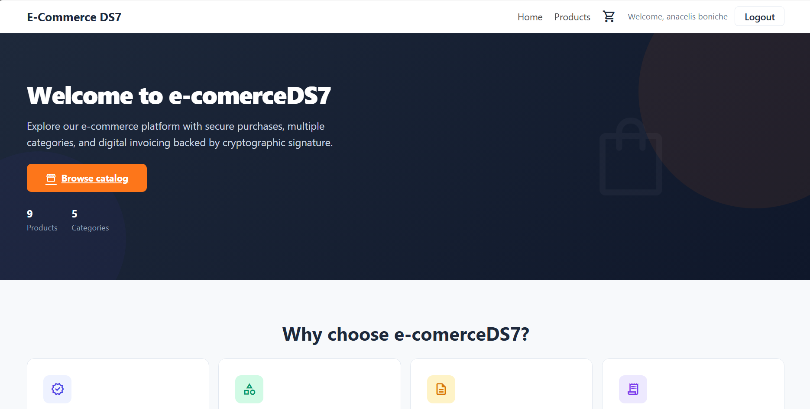
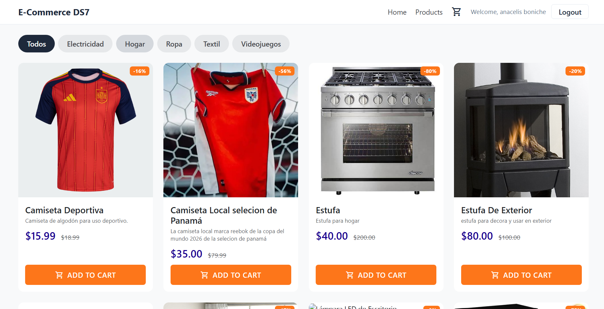
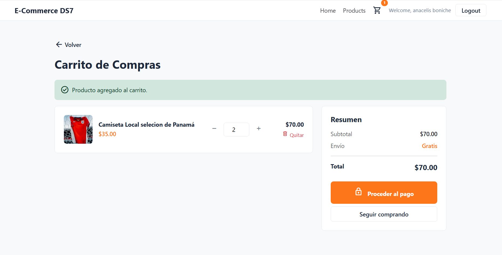
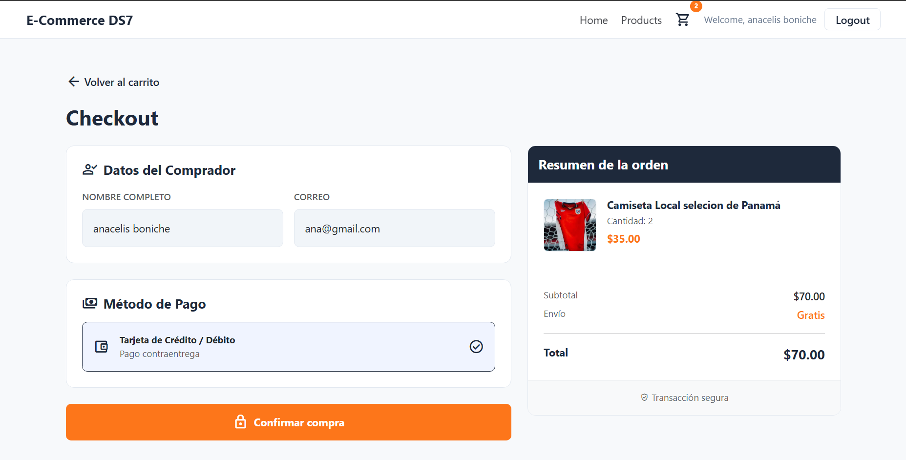
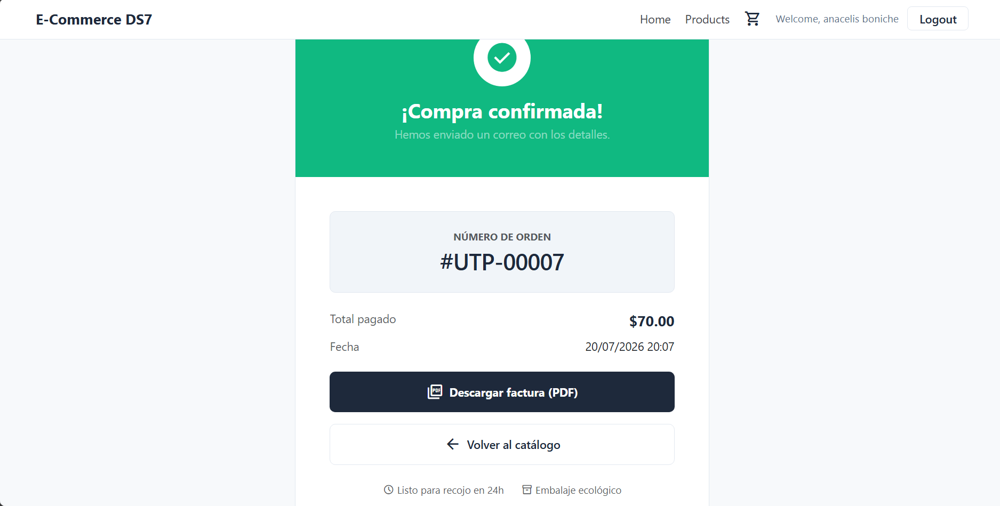
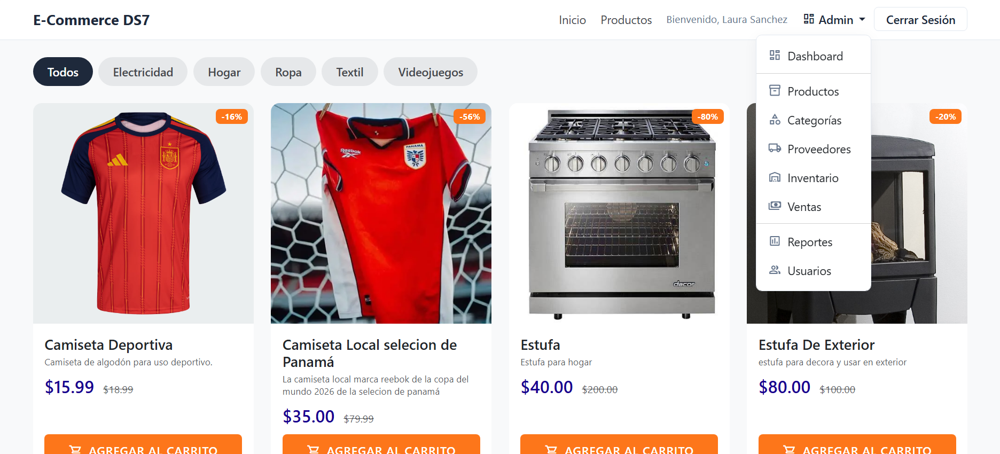
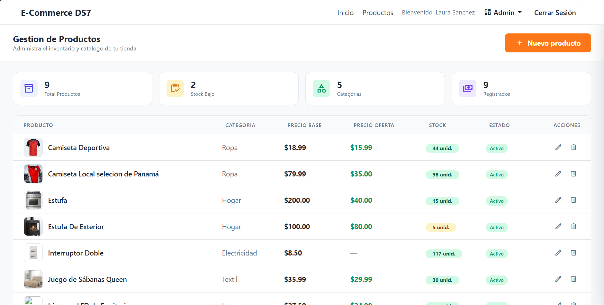
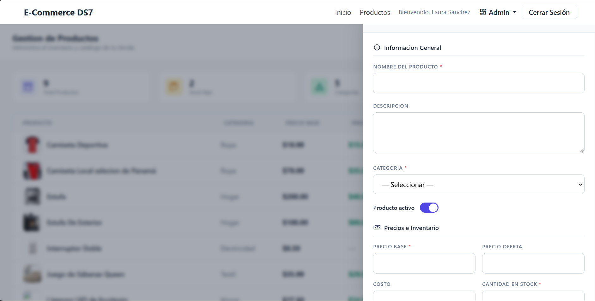
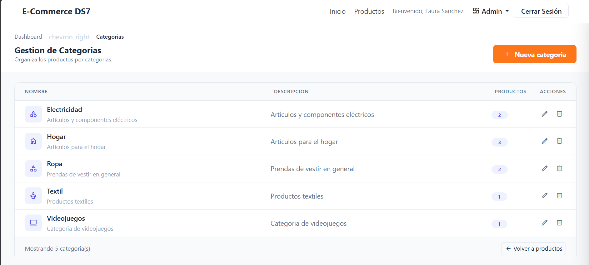
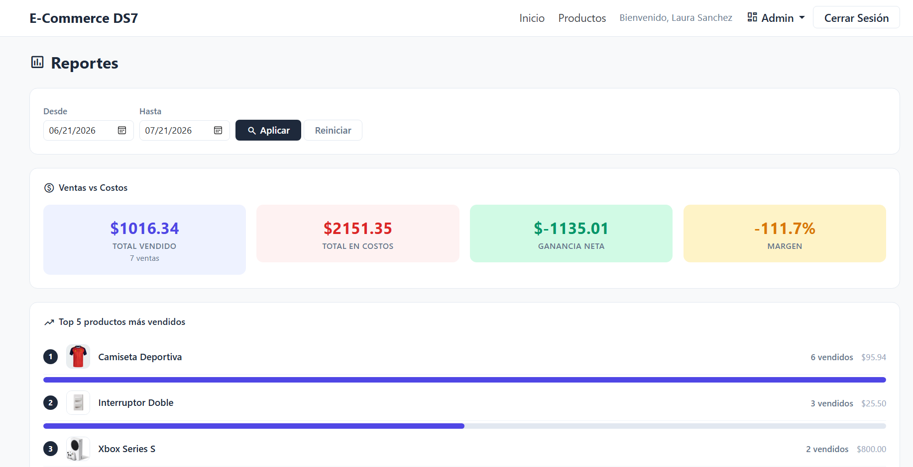

# 📑 e-comerceDS7 — Resumen del Proyecto

## 1. Información General y Evidencia Práctica

### 1.1. Nombre del Proyecto
**e-comerceDS7** — Sistema de Venta de Productos con Carrito de Compras.

### 1.2. Integrantes del Equipo

| Nombre | Cédula | 
|---|---|---|
| Samuel Ojo Ruiz | *[8-1031-1344]* | 
| Anacelis Boniche | *[8-1032-665]* | 
| Danel Morales | *[8-1006-2453]* | 
| Diego Vasquez | *[8-1002-2253]* | 

Examen final de **Desarrollo de Software VII**, Universidad Tecnológica de Panamá — Facultad de Ingeniería en Sistemas Computacionales, Grupo 1GS133.

### 1.3. Fecha del Sistema y Versión
- **Versión:** v2.0
- **Fecha de entrega:** 21/07/2026

### 🎥 1.4. Demostración en Video
> *[Enlace directo al video — YouTube / Drive — donde el grupo sustenta, ejecuta el sistema y demuestra el funcionamiento real de las pantallas y las validaciones de seguridad]*

---

## 2. Requisitos de Infraestructura (¿Cómo hacerlo funcionar?)

### 2.1. Entorno de Ejecución
- **PHP:** 8.0 o superior
- **Motor de base de datos:** MySQL / MariaDB (InnoDB, utf8mb4)
- **Servidor local:** WampServer (Apache + MySQL + PHP) — funciona igual de bien con XAMPP o Laragon, ajustando la ruta del proyecto y el `RewriteBase` del `.htaccess` según corresponda.
- **Dependencia PHP externa:** TCPDF 6.11, vía Composer (única dependencia de terceros permitida en el proyecto).

### 2.2. Guía de Despliegue Rápido

**1. Clonar el repositorio:**
```bash
git clone https://github.com/Samex-26/e-comerceDS7.git e-comerceDS7
```
Colócalo dentro de `C:\wamp64\www\` (o el `htdocs` equivalente de XAMPP/Laragon). El nombre de la carpeta debe ser `e-comerceDS7`, o ajusta la constante `BASE_URL` en `app/config/config.php` si usas otro nombre.

**2. Instalar dependencias (TCPDF):**
```bash
composer install
```

**3. Configurar credenciales locales de base de datos:**
```bash
cp app/config/config.example.php app/config/config.php
```
Edita `app/config/config.php` y completa:
- Credenciales de conexión MySQL (host, usuario, contraseña, nombre de la BD: `venta_productos`)
- Una clave secreta propia para `SECRET_KEY` (usada por `FirmaDigitalService` para las firmas HMAC-SHA256 de integridad)

**4. Importar la base de datos:**

Script de respaldo con la estructura completa y datos semilla (idiomas, categorías) para pruebas rápidas:
```
venta_productos.sql
```
> Enlace al backup: https://github.com/Samex-26/e-comerceDS7/blob/main/venta_productos.sql

Impórtalo en phpMyAdmin o vía consola:
```bash
mysql -u root -p venta_productos < venta_productos.sql
```

Luego carga los dos usuarios de prueba (ver sección 3, tabla de credenciales):
```bash
mysql -u root -p venta_productos < seed_usuarios.sql
```

**5. Habilitar reescritura de URLs:**

Verifica en la configuración de Apache que `rewrite_module` esté activo y que `AllowOverride` esté en `All`, para que el `.htaccess` de `/public` funcione correctamente.

**6. Acceder al sistema:**
```
http://localhost/e-comerceDS7/public/
```

---

## 3. Matriz de Roles y Credenciales de Prueba

| Rol de Usuario | Usuario de Acceso | Contraseña de Prueba | Permisos / Qué puede hacer |
|---|---|---|---|
| **Administrador** | `admin@correo.com` | `Admin12345` | Control total: gestión de productos, categorías, proveedores, inventario, usuarios, ventas, dashboard con KPIs y reportes. **No tiene acceso a compras** (carrito/checkout restringido exclusivamente al rol cliente). |
| **Estudiante / Operador (cliente)** | `user@correo.com` | `Cliente12345` | Acceso al catálogo público, carrito de compras, checkout, historial de compras y factura en PDF. Sin acceso al panel administrativo. |

**Cómo cargar estas dos cuentas:**

Ejecuta el script `seed_usuarios.sql` (incluido en la raíz del repositorio) contra la base de datos `venta_productos` ya creada:
```bash
mysql -u root -p venta_productos < seed_usuarios.sql
```
Las contraseñas ya están hasheadas con bcrypt (compatibles con `password_verify()` de PHP) — no se almacena ni se transmite texto plano en ningún momento.

---

## 4. Directrices Técnicas y Reglas del Backend

### 4.2. Mitigación OWASP y DRY

**Protección CSRF:**
- Todos los formularios de autenticación (`auth/login`, `auth/registro`) y de escritura (productos, categorías, proveedores, inventario, checkout, usuarios) generan un token vía `Controller::generarTokenCsrf()` y lo validan con `Controller::verificarTokenCsrf()` antes de procesar cualquier `POST`.
- Ubicación: `app/core/Controller.php` (métodos base) y cada método `procesar*()` de los controladores en `app/controllers/`.
- Esto bloquea peticiones directas por herramientas externas (Postman, cURL) que no incluyan un token válido generado por el propio formulario.

**Separación limpia de archivos (DRY):**
- Sanitización y validación centralizadas en clases separadas: `app/helpers/Sanitizer.php` y `app/helpers/Validator.php` — usadas por todos los controladores, evitando duplicar lógica de limpieza/validación de entrada en cada uno.
- Lógica de verificación de rol reutilizada desde la clase base `app/core/Controller.php` (`verificarAdmin()`, `verificarCliente()`), en lugar de repetir la comprobación de sesión/rol en cada controlador individual.
- Un modelo por entidad de base de datos en `app/models/`, con las consultas PDO encapsuladas ahí — los controladores nunca escriben SQL directamente.
- Prepared statements (PDO) en el 100% de las consultas, sin excepción.

### 4.3. Sello de Integridad — Firma Digital

El backend implementa un patrón de contrato (`app/contracts/CriptoServiceInterface.php`) que desacopla la operación criptográfica del algoritmo específico:

```php
interface CriptoServiceInterface
{
    public function procesar(string $dato): string;
    public function verificar(string $dato, string $resultadoEsperado): bool;
}
```

Implementado por dos servicios:
- **`PasswordHasherService`** (`app/services/PasswordHasherService.php`) — hashing de contraseñas con `password_hash()` / `PASSWORD_BCRYPT`.
- **`FirmaDigitalService`** (`app/services/FirmaDigitalService.php`) — firma digital de ventas con `hash_hmac('sha256', $dato, SECRET_KEY)`, y verificación con `hash_equals()` (comparación segura contra *timing attacks*).

**Flujo al confirmar una venta** (`app/controllers/VentaController.php`):
1. Al insertar el registro de venta, se concatena la información crítica de la transacción (productos, cantidades, precios, total) en una cadena.
2. `FirmaDigitalService::procesar()` calcula la firma HMAC-SHA256 de esa cadena.
3. Se guarda en la tabla `ventas`: `hash_datos` (hash de integridad) y `firma_digital` (firma calculada).
4. En cualquier momento posterior, el sistema puede recalcular el hash de los datos actuales y compararlo contra `hash_datos`, además de verificar la firma con `FirmaDigitalService::verificar()` — si alguien alteró manualmente un registro de venta en la base de datos (ej. cambiando el total o los productos), el hash ya no coincide y la firma deja de validar, delatando la manipulación.
5. El hash y la firma también se imprimen en la factura PDF generada (`FacturaController.php`, plantilla TCPDF) como respaldo visible de integridad.

Esto protege específicamente los datos de **ventas** en reposo contra manipulaciones directas en la base de datos, fuera del flujo normal de la aplicación.

---

## 5. Manual de Usuario Operativo

**Video del proyecto:** *[URL del video indicando cómo se usa el sistema]*

### 5.1. Guía Visual — Recorrido paso a paso


**Como usuario (cliente):**
1. **Mira la pag de inicio:** desde la página de inicio, el usuario navega y puede acceder a la seccion catalogo o conocer mas de la tienda

2. **Buscar y Agregar al carrito:** el usuario accede al detalle de un producto desde el catálogo para ver descripción, precio y imagen, despues desde, el botón de agregar suma el producto al carrito de compras (requiere sesión iniciada como cliente).

3. **Modificar cantidades:** dentro del carrito, los controles +/- (o el spinner nativo del campo numérico) actualizan la cantidad de forma automática, recalculando subtotal y total en pantalla sin recargar la página.

4. **Finalizar compra:** el botón "Proceder al pago" lleva al checkout, protegido con token CSRF; al confirmar, la venta queda registrada y firmada digitalmente, y se genera la factura en PDF descargable.



**Como administrador:**
1. **Iniciar sesión** con una cuenta con rol `admin` — el menú "Admin" aparece en la barra de navegación (el ícono de carrito de compras permanece oculto, ya que las compras son exclusivas del rol cliente).

2. **Agregar un producto:** desde el panel de administración de productos, un formulario permite crear un nuevo producto (nombre, descripción, precio, precio de oferta, categoría, imagen, cantidad en stock).


3. **Modificar un registro:** cada fila del listado tiene una acción de edición que abre el formulario prellenado con los datos actuales para actualizarlos.

4. **Consultar métricas:** el Dashboard muestra KPIs (ventas del mes, ganancia neta, productos vendidos, visitantes) con gráficas (Chart.js), y el módulo de Reportes permite comparar ventas vs. costos por rango de fechas y ver los productos más/menos vendidos y visitados.


---

## Enlaces del Proyecto

- **Repositorio:** https://github.com/Samex-26/e-comerceDS7.git
- **Backup de la base de datos:** https://github.com/Samex-26/e-comerceDS7/blob/main/venta_productos.sql

---

*Proyecto académico — Universidad Tecnológica de Panamá, Facultad de Ingeniería en Sistemas Computacionales, Grupo 1GS133. Uso educativo.*